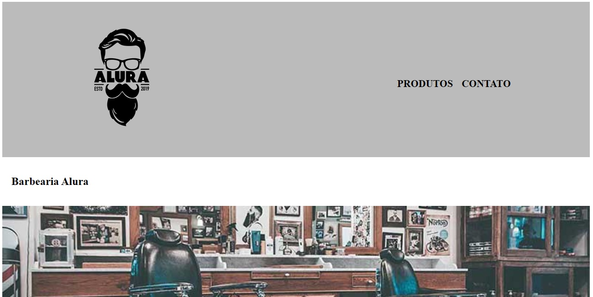
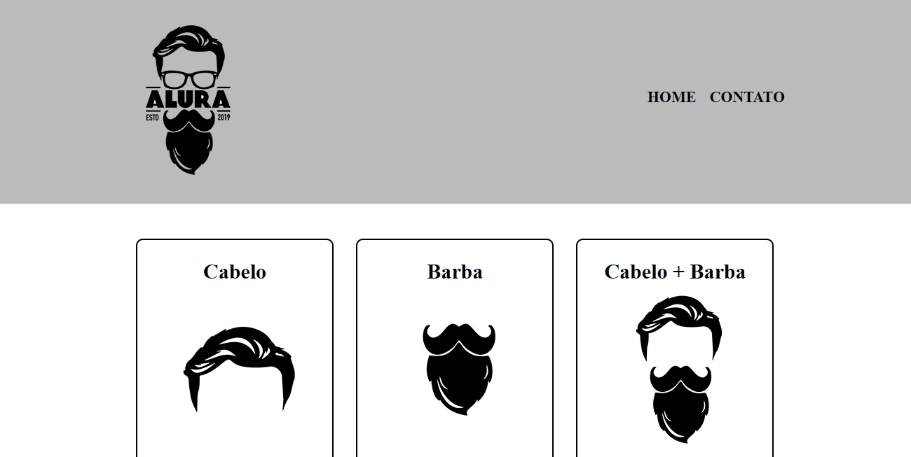
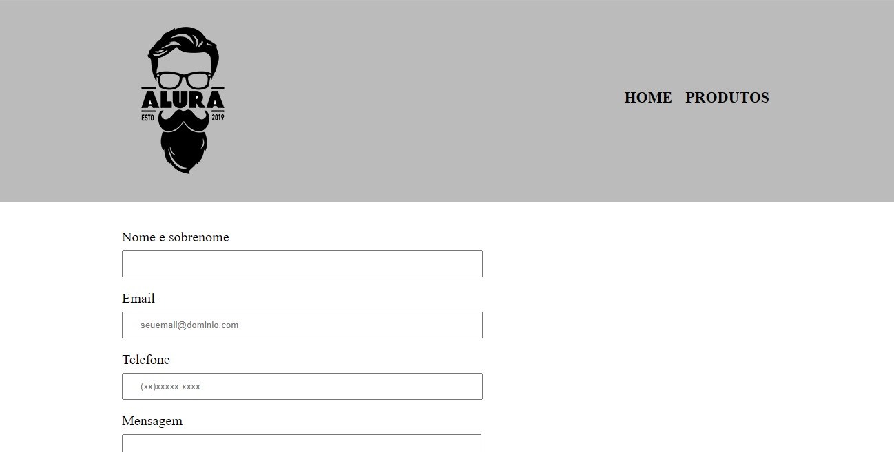

<h1 align="center"> Barbearia Alura </h1>

Projeto desenvolvido no curso de HTML5 e CSS3 (pt1, pt2, pt3 e pt4) da Alura.

  <a href="#-tecnologias">Tecnologias</a>&nbsp;&nbsp;&nbsp;|&nbsp;&nbsp;&nbsp;
  <a href="#-projeto">Projeto</a>&nbsp;&nbsp;&nbsp;|&nbsp;&nbsp;&nbsp;
  <a href="#-layout">Layout</a>&nbsp;&nbsp;&nbsp;|&nbsp;&nbsp;&nbsp;
  <a href="#memo-licença">Licença</a>

  

 

  
   
   
  
   
   
  

## 🚀 Tecnologias

Esse projeto foi desenvolvido com as tecnologias:

- HTML e CSS
- Git e GitHub

## 💻 Projeto

Página com informações sobre a Barbearia alura

## 🔖 Layout

Você pode visualizar um pouco do layout do projeto no topo desse readme.

## :memo: Licença

Esse projeto está sob a licença MIT.

---

Design by Rafaelly Lemos :wave: - [Acesse o meu LinkedIn](https://www.linkedin.com/in/rafaelly-lemos)